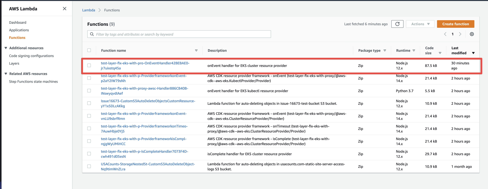
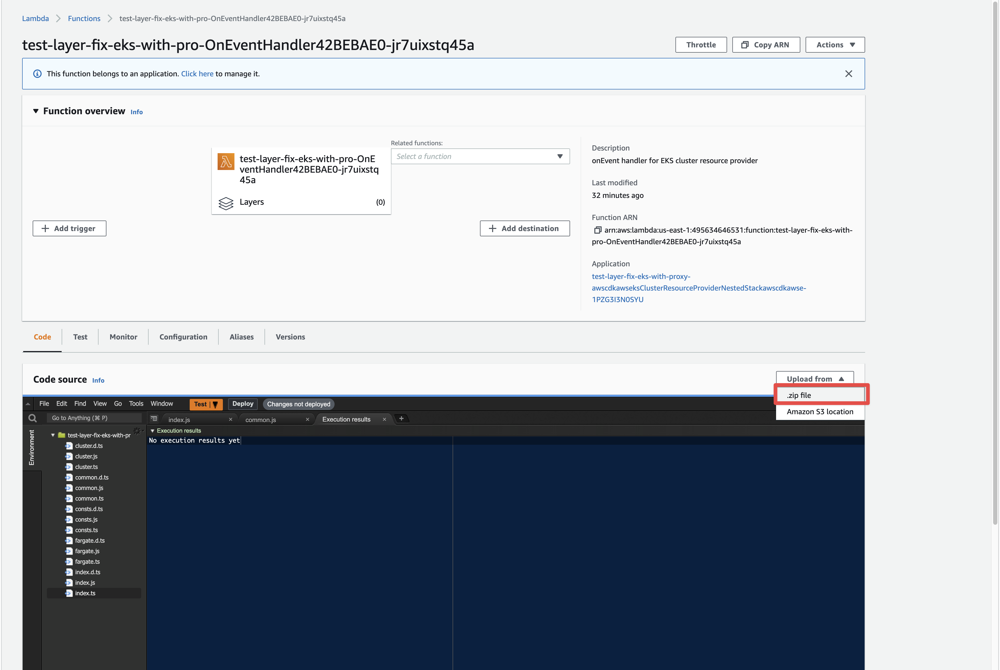
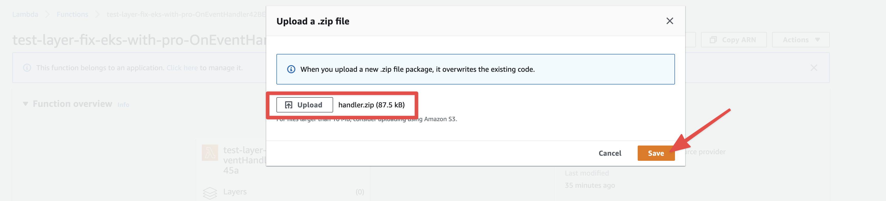

# aws-cdk-eks-lambda-proxy-workaround

Workaround for proxy support in the onEvent EKS Lambda. This workaround is necessary until [this fix](https://github.com/aws/aws-cdk/pull/16657) is released.

## Before you continue

This workaround involves replacing the EKS's "onEventHandler" Lambda function through the AWS Console.

This workaround expects that you have already deployed the EKS cluster using `"aws-cdk": "1.125.0"` or below.

This workaround expects that you have configured your cluster for proxy support.

e.g.
```ts
import { Cluster, KubernetesVersion } from '@aws-cdk/aws-eks';
import { Port } from '@aws-cdk/aws-ec2';

const cluster = new Cluster(stack, 'hello-eks', {
  vpc,
  version: KubernetesVersion.V1_21,
  placeClusterHandlerInVpc: true,
  clusterHandlerEnvironment: {
    http_proxy: `http://user1:user1@${proxyInstance.instancePublicIp}:3128`, // Set the http_proxy environment variable to the proxy server's URL
  },
});
cluster.connections.allowTo(proxyInstance, Port.tcp(80), 'Allow HTTP traffic to the proxy server');
```

## Steps

**1. Clone this repo and step in**

```sh
$ git clone https://github.com/ryparker/aws-cdk-eks-lambda-proxy-workaround.git
$ cd aws-cdk-eks-lambda-proxy-workaround.git
```

**2. Run the bundle script to build the Docker image and output a `handler.zip` file.**

*Docker daemon must be running*

```sh
$ ./bundle.sh
```

**3. Locate the EKS's "onEventHandler" Lambda function in the [AWS Console](https://console.aws.amazon.com/lambda/home#/functions)**

The "onEventHandler" Lambda will match the following features:
Function name: `<STACK_NAME>-OnEventHandler42BEBAE0-jr7uixstq45a`
Description: `onEvent handler for EKS cluster resource provider`

<br />
<kbd>

</kbd>
<br />
<br />

**4. Click `Upload from` and select `.zip file`**

<br />
<kbd>

</kbd>
<br />
<br />

**5. Upload the `handler.zip` we created in step 2. Then click save**

<br />
<kbd>

</kbd>
<br />
<br />
